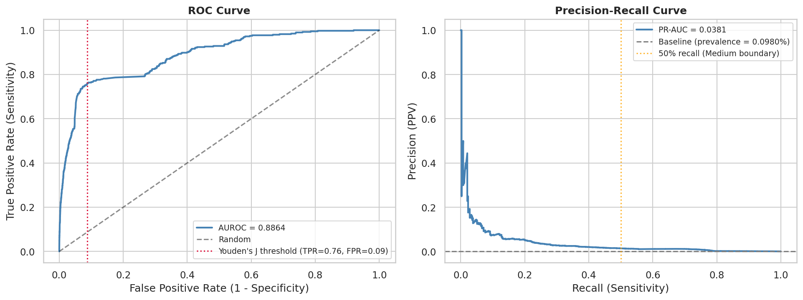
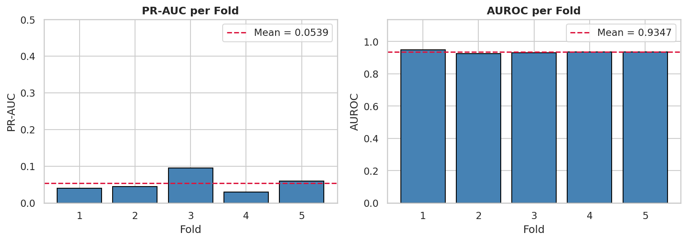
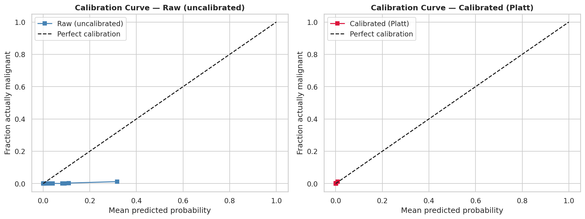
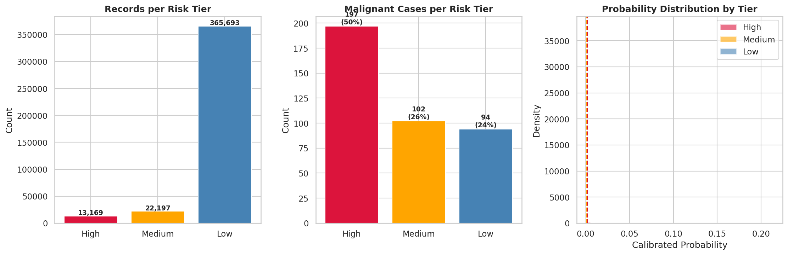

# Melanoma Risk Scoring — Model v2

## Problem Statement

Classify skin lesion records from the ISIC 2024 dataset into three clinical risk tiers — **Low, Medium, and High** — for melanoma malignancy, using tabular metadata only (no dermoscopic images). The goal is to support early triage by surfacing which lesions most warrant clinical attention.

---

## Dataset

| Property | Value |
|---|---|
| Source | ISIC 2024 Challenge — tabular metadata |
| Total records | 401,059 |
| Malignant | 393 (0.098%) |
| Benign | 400,666 (99.902%) |
| Class imbalance | 1 : 1,020 |
| Features (after encoding) | 72 |

**Feature types**: age, lesion size, TBP chromatic/color metrics, border and shape descriptors, anatomical location, sex.

---

## Pipeline

### 1. Preprocessing

- Median imputation for numeric nulls; mode imputation for categorical nulls
- Biological value clipping: age ≤ 85, eccentricity ∈ [0, 1], nevi confidence ∈ [0, 100]
- Six engineered features derived from existing columns:

| Feature | Formula |
|---|---|
| `color_contrast_3d` | √(ΔA² + ΔB² + ΔL²) |
| `elongation` | minor axis / (long diameter + ε) |
| `nevi_color_tension` | nevi confidence × norm color |
| `log_area` | √(lesion area mm²) |
| `compactness` | perimeter² / (4π × area + ε) |
| `chroma_contrast` | \|tbp_lv_C − tbp_lv_Cext\| |

- `tbp_lv_symm_2axis` excluded — Mann-Whitney U test returned p = 0.143 (no statistically significant separation between benign and malignant groups)

### 2. Cross-Validation

**StratifiedGroupKFold, 5 folds, grouped by `patient_id`**

Records from the same patient are always kept in the same fold. This prevents leakage from correlated lesions belonging to the same person, which would otherwise inflate validation metrics. Stratification preserves the malignant:benign ratio across folds.

### 3. Class Imbalance Handling

Two complementary techniques are applied together:

| Technique | Setting | Purpose |
|---|---|---|
| **SMOTE** | `sampling_strategy=0.1` | Generates synthetic malignant samples inside each training fold until malignant:benign ≈ 1:10, giving the model enough minority-class signal |
| **`scale_pos_weight=10`** | LightGBM parameter | Further weights each real malignant sample 10× in the loss function to account for residual imbalance |

SMOTE is applied **strictly inside each training fold** — the validation set is never touched or resampled.

### 4. Model — LightGBM

Gradient-boosted decision trees (`LGBMClassifier`).

| Hyperparameter | Value | Rationale |
|---|---|---|
| `n_estimators` | 1,000 | Upper limit; early stopping controls actual count |
| `learning_rate` | 0.02 | Conservative — avoids overfitting with many trees |
| `num_leaves` | 63 | Moderate complexity for ~350k training records |
| `min_child_samples` | 20 | Prevents leaf nodes from fitting to very few malignant records |
| `subsample` | 0.8 | Row subsampling — reduces variance |
| `colsample_bytree` | 0.8 | Feature subsampling per tree |
| `reg_alpha` | 0.1 | L1 regularization |
| `reg_lambda` | 0.1 | L2 regularization |
| `metric` | `auc` | Scale-invariant — not misled by the 1:1020 base rate |
| Early stopping patience | 100 | Stops when validation AUC plateaus |

### 5. Probability Calibration — Platt Scaling

Raw LightGBM probabilities are inflated because the model is trained on SMOTE-resampled data (1:10 ratio) rather than the true 0.098% prevalence. A **logistic regression** is fitted on the pooled out-of-fold (OOF) raw probabilities against true labels. Because OOF predictions are never seen during training, this calibration step is valid and leakage-free.

### 6. Risk Tier Thresholds

Two probability thresholds are derived from the OOF calibrated probabilities:

| Boundary | Method | Probability |
|---|---|---|
| **Medium → High** | Highest PR-curve threshold achieving ≥ 50% recall | 0.001544 |
| **Low → Medium** | Youden's J — maximises (Sensitivity + Specificity − 1) on ROC curve | 0.000825 |

Tier assignment:
- **High**: calibrated probability ≥ 0.001544
- **Medium**: 0.000825 ≤ calibrated probability < 0.001544
- **Low**: calibrated probability < 0.000825

---

## Results

### Discrimination Metrics

| Metric | Value |
|---|---|
| Mean AUROC — 5-fold CV (raw) | **0.9347 ± 0.008** |
| AUROC — calibrated OOF | 0.8864 |
| Mean PR-AUC — 5-fold CV (raw) | 0.0539 ± 0.026 |
| PR-AUC random baseline (= prevalence) | ~0.001 |
| PR-AUC vs random baseline | **~55× better** |

AUROC of 0.9347 means: if one malignant and one benign record are drawn at random, the model ranks the malignant higher 93.5% of the time.

PR-AUC of 0.054 looks small in isolation but must be interpreted relative to the prevalence baseline (~0.001 at 0.098% malignancy rate). The model is 55× better than random on the precision-recall tradeoff.

The left plot shows the ROC curve — the steep early rise confirms the model separates malignant from benign well before reaching high false-positive rates. The right plot shows the Precision-Recall curve; the dashed gray line is the random baseline (prevalence = 0.098%), and the model consistently sits above it.

Per-fold stability ([`outputs/results/v2/v2_model_metrics.csv`](../outputs/results/v2/v2_model_metrics.csv)):

AUROC is consistent across all five folds (std = 0.008), confirming the model is not overfitting to a single fold's patient group.

### Calibration

Raw LightGBM probabilities are inflated ~10× by SMOTE resampling. Platt scaling corrects this:

| | Brier Score |
|---|---|
| Raw (uncalibrated) | 0.009163 |
| Calibrated (Platt) | **0.000963** |
| Baseline (always predict base rate) | 0.000979 |

The calibrated Brier score is essentially equal to the theoretical minimum — near-perfect probability calibration.

The left panel shows the raw model's probabilities are severely overestimated. The right panel shows the calibrated probabilities tracking the diagonal (perfect calibration) closely.

### Risk Tier Summary

| Tier | Records | % of Total | Malignant Captured | Sensitivity | PPV | vs Base Rate |
|---|---|---|---|---|---|---|
| **High** | 13,169 | 3.3% | 197 | 50.1% | 1.50% | **15.3×** |
| **Medium** | 22,197 | 5.5% | 102 | 26.0% | 0.46% | **4.7×** |
| **Low** | 365,693 | 91.2% | 94 | 24.0% | 0.026% | 0.26× |
| **High + Medium** | 35,366 | 8.8% | 299 | **76.1%** | 0.85% | **8.7×** |

- The model directs 91.2% of records to Low risk while capturing 76.1% of all malignant cases in the top two tiers combined.
- The High tier alone is **15× enriched** over the population malignancy rate.
- Low tier PPV (0.026%) is well **below** the base rate (0.098%), correctly de-risking the bulk of records.

The left panel shows how records are distributed across tiers. The middle panel shows how malignant cases concentrate in High and Medium. The right panel shows the probability distributions per tier — the thresholds (dashed lines) cleanly separate the distributions.

Full tier breakdown: [`outputs/results/v2/v2_risk_tiers.csv`](../outputs/results/v2/v2_risk_tiers.csv)

---

## Key Design Decisions

| Decision | Alternative Considered | Rationale |
|---|---|---|
| SMOTE applied inside each fold | SMOTE before CV split | Prevents synthetic samples from leaking into validation sets |
| StratifiedGroupKFold by patient ID | Random KFold | Lesions from the same patient are correlated — random splits inflate metrics |
| Platt scaling calibration | No calibration | Raw probabilities are ~10× inflated from SMOTE resampling distribution |
| Youden's J + 50% recall thresholds | Fixed 0.5 cutoff | A fixed 0.5 threshold produces zero positives at 1:1020 imbalance |
| AUROC + PR-AUC dual reporting | Accuracy | Accuracy is 99.9% by always predicting benign — useless for imbalanced data |
| LightGBM | Logistic Regression, SVM | Handles non-linear interactions, mixed feature types, early stopping, fast |

---

## Limitations

- **24% of malignant cases remain in Low tier.** At 1:1020 imbalance with tabular-only features, achieving 100% recall without flagging the entire dataset is not feasible. The model captures 76% in High+Medium, which is clinically meaningful triage.
- **No held-out test set.** Evaluation is entirely cross-validated OOF. The model has not been evaluated on a fully independent dataset.
- **Tabular features only.** Dermoscopic image features are not used. Adding image-based embeddings would likely improve discrimination substantially.
- **SHAP explainability disabled** in the current run due to compute time (~10–30 min on 400k records). The code is present and commented out in `notebooks/melanoma_v2.ipynb`.
