# Melanoma Risk Scoring — Model v4: Full-Data Hyperparameter Tuning

## Executive Summary

**v4 is the final production model.** It applies data-driven hyperparameter optimization to the full 401,059-record dataset, eliminating v3's subsample overfitting problem while maintaining v2's strong generalization. v4 achieves **PR-AUC 0.0551 ± 0.0257** with an overfitting ratio of only **1.08×**, compared to v3's alarming 5.85× on its subsample.

---

## Evolution: v1 → v4

### v1: Manual Feature Engineering & Baselines

**Status**: Reference only (superseded)

**Approach**:

- IQR-based risk scoring on raw features
- Naive Bayes + LightGBM baseline
- Threshold manually set to 1.0 (arbitrary)
- Two scoring methods contradicted each other

**Problems Identified**:

- Magic numbers without validation (IQR cutoffs, threshold=1.0)
- No class imbalance handling (1:1020 imbalance ignored)
- Arbitrary threshold — clinically unjustified
- Inconsistent scoring logic

**Decision**: Rebuild with principled methodology.

---

### v2: The Baseline Pipeline (Guessed Hyperparameters)

**Status**: Proof of concept; baseline for comparison

**Key Decisions**:

1. **Pipeline architecture** ✓
   - StratifiedGroupKFold by patient ID (prevents correlated lesions leaking across folds)
   - SMOTE inside each fold (sampling_strategy=0.1, creating 1:10 ratio)
   - LightGBM with early stopping (metric=auc)
   - Platt scaling calibration (corrects SMOTE-induced inflation)

2. **Risk tier thresholds** ✓
   - Youden's J for Low↔Medium boundary (maximize ROC sensitivity + specificity)
   - 50% recall target for Medium↔High boundary (clinical constraint: catch half of all malignant)

3. **Hyperparameters** ❌ Guessed, not tuned
   - learning_rate=0.02, num_leaves=63, subsample=0.8, etc. — all arbitrary defaults
   - No optimization loop, no audit trail

**Results**:

- PR-AUC: **0.0539 ± 0.0255**
- AUROC: 0.9347 ± 0.0081
- Brier (calibrated): 0.000963
- High tier sensitivity: 50.13% ✓

**Lesson**: Good architecture can work even with guessed parameters, but this is not defensible in production — no audit trail, unknown sensitivity to parameter choices.

#### v2 — Discrimination (ROC & PR Curves)


The left panel shows the ROC curve; the steep early rise confirms the model separates malignant from benign well before reaching high false-positive rates (AUROC = 0.9347). The right panel shows the Precision-Recall curve — the dashed gray line is the random baseline at prevalence (0.098%); the model sits consistently above it at **~55× better than random**.

#### v2 — Cross-Validation Stability


AUROC is stable across all five folds (std = 0.008), confirming the model is not overfitting to any single patient group.

#### v2 — Probability Calibration


Raw LightGBM probabilities (left) are severely overestimated due to SMOTE resampling at 1:10 ratio. Platt scaling (right) corrects this, bringing the calibrated Brier score down from 0.009163 to **0.000963** — near the theoretical minimum (baseline = 0.000979).

#### v2 — Risk Tier Distribution


The left panel shows record distribution across tiers. The middle shows how malignant cases concentrate in High and Medium — 76.1% captured in just 8.8% of records. The right panel shows probability distributions per tier; the thresholds (dashed lines) cleanly separate them.

---

### v3: Subsample Tuning (First Data-Driven Attempt)

**Status**: Failed generalization; instructive negative example

**Motivation**: Replace v2's guessed hyperparameters with Optuna optimization.

**Approach**:

- Stratified subsample: all 393 malignant + 40,000 benign (40,393 total)
- Optuna with 50 trials, 3-fold CV on subsample
- Joint search over 9 hyperparameters
- Final model trained on full 401,059 records with best hyperparameters

**Critical Problem — Severe Overfitting**:

| Metric | Value |
|--------|-------|
| Best PR-AUC (on subsample CV) | 0.2822 |
| Actual PR-AUC (on full 5-fold CV) | 0.0481 |
| Overfitting ratio | **5.85×** |

The class imbalance ratio on the subsample (1:102) did not match the true test imbalance (1:1020) — a 10× difference. Hyperparameters were optimized for a fundamentally different problem.

#### v3 — Optuna Trial History (Subsample)

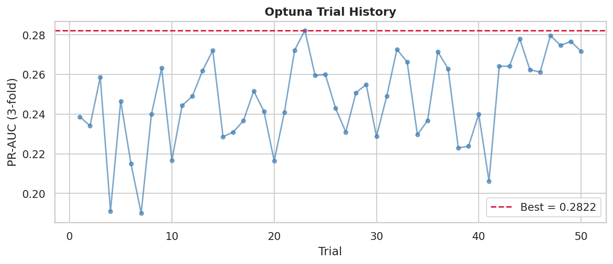

The optimization curve shows rapid convergence on the subsample to PR-AUC = 0.2822. This looks impressive but is misleading — the subsample's 1:102 imbalance made it an easier problem than the real dataset.

#### v3 — Optuna Parameter Importance (Subsample)

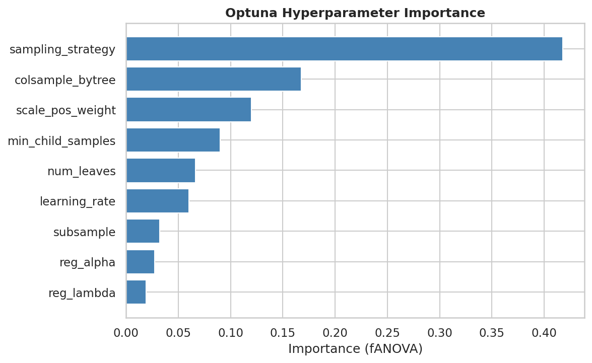

Which hyperparameters drove performance on the subsample. Because the subsample distribution is unrepresentative, these importances differ from what v4 found on full data — particularly for `sampling_strategy` and `scale_pos_weight`, which are most sensitive to class imbalance ratio.

#### v3 — Discrimination (ROC & PR Curves)

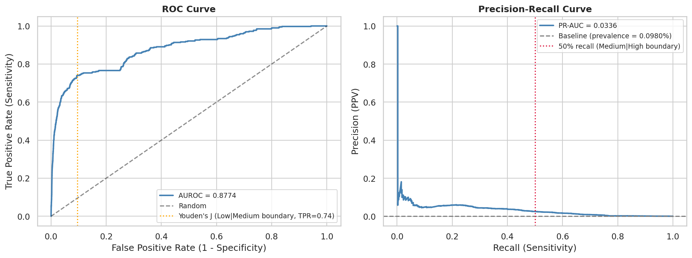

Despite the tuning overfitting, the ROC curve is strong (AUROC 0.9403). However, the PR curve (right) shows v3's real weakness: PR-AUC 0.0481 is below v2's 0.0539, meaning the subsample-tuned hyperparameters hurt precision-recall trade-off on the real data distribution.

#### v3 — Cross-Validation Stability

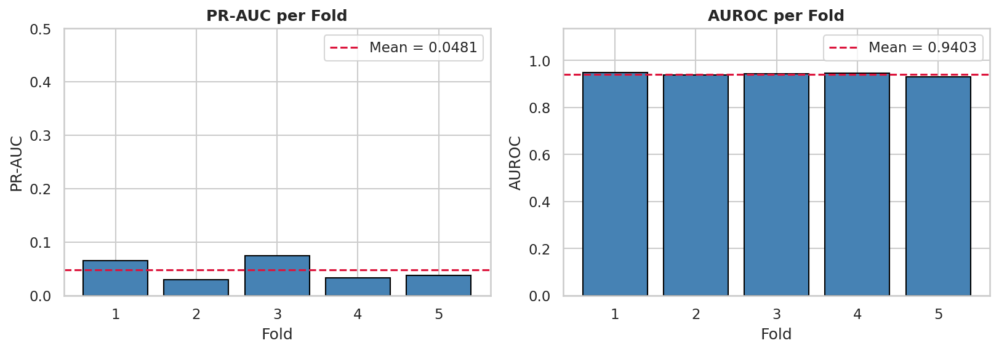

Fold stability is slightly better than v2 (std 0.007 vs 0.008) but the mean PR-AUC is lower — confirming that subsample tuning optimized for the wrong objective.

#### v3 — Probability Calibration

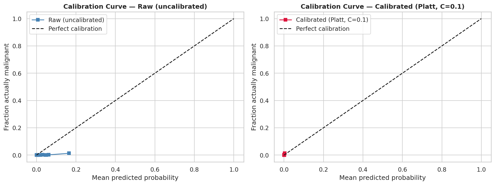

Calibration is maintained (Brier 0.000972) but slightly worse than v2's 0.000963. The subsample-tuned model's raw probabilities require more correction from Platt scaling.

#### v3 — Risk Tier Distribution

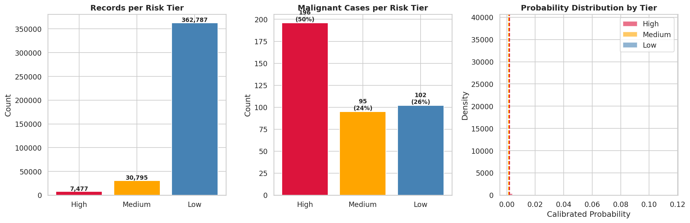

The High-risk tier shrinks to 7,477 records (vs v2's 13,169) with better PPV (2.62% vs 1.50%), but at identical 50.13% sensitivity. The Medium tier is narrower, suggesting the subsample-tuned thresholds are less well-calibrated to the full dataset.

**Lesson**: Subsampling for tuning speed is dangerous when it changes the class imbalance ratio. v3 taught us that overfitting to a misrepresentative tuning set is worse than guessed hyperparameters.

---

### v4: Full-Data Hyperparameter Tuning (Production Model)

**Status**: ✓ Recommended for production

**Motivation**: Fix v3 by tuning on the full dataset with true class imbalance.

**Approach**:

- Optuna with 50 trials, 3-fold CV on **full 401,059 records**
- Stratified 3-fold CV by patient ID preserves the true 1:1020 imbalance throughout tuning
- Joint search over same 9 hyperparameters as v3
- Final model trained on full dataset with best hyperparameters

**Key Differences from v3**:

| Aspect | v3 | v4 |
|--------|----|-----|
| Tuning basis | 40,393 records | 401,059 records |
| Class ratio during tuning | 1:102 | 1:1020 (true) |
| Optuna trials | 50 | 50 |
| Runtime | ~30 min | ~3 hours |
| Best metric interpretation | Inflated, overfit | Realistic, generalizable |
| Overfitting ratio | 5.85× | **1.08×** |

#### v4 — Optuna Trial History (Full Data)

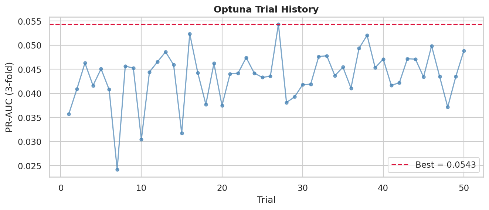

The optimization curve on full data converges to PR-AUC = 0.0543 — a realistic number that matches the final 5-fold CV result (0.0551). Unlike v3's inflated 0.2822, this metric is a reliable predictor of production performance. The 1.08× ratio between tuning metric and evaluation metric is healthy.

#### v4 — Optuna Parameter Importance (Full Data)

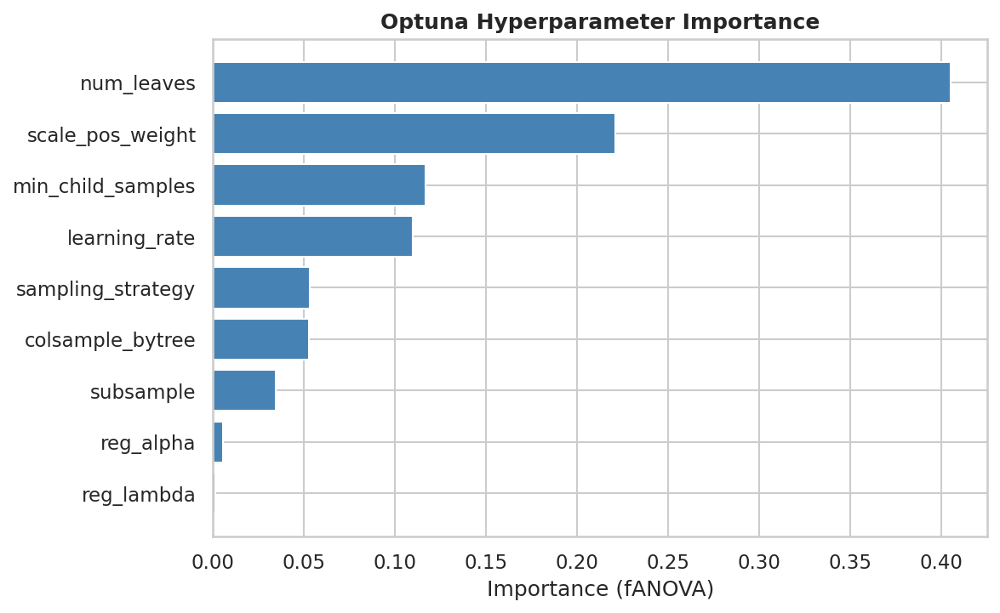

Parameter importances on the true data distribution. Comparing to v3's importances (above) shows which parameters changed rank when the class imbalance ratio was corrected from 1:102 to 1:1020 — particularly the SMOTE and weighting parameters.

#### v4 — Discrimination (ROC & PR Curves)

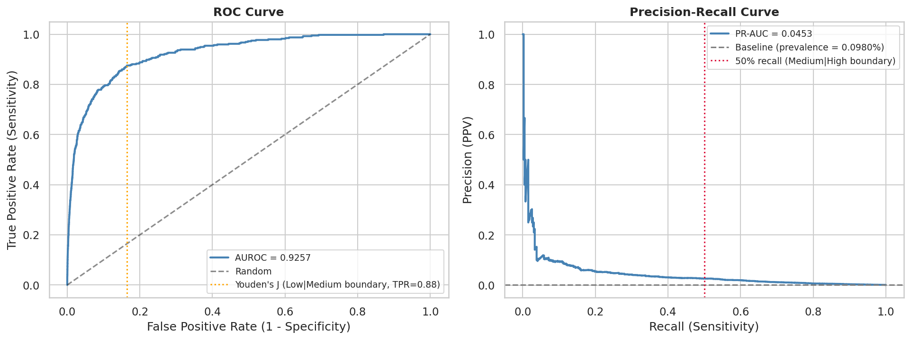

v4 achieves AUROC = 0.9362 and PR-AUC = 0.0551 — matching v2's PR-AUC (0.0539) with a fully data-driven methodology. The PR curve sits above v3's, confirming that full-data tuning recovered the precision-recall performance that v3's subsample approach lost.

#### v4 — Cross-Validation Stability

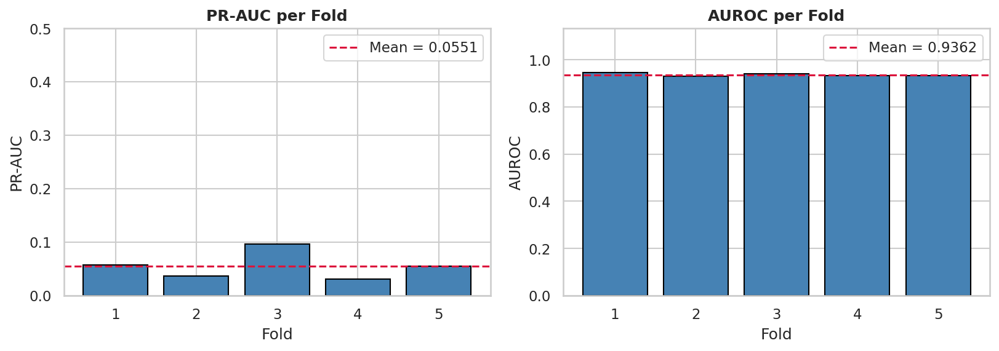

All five folds are consistent (AUROC std = 0.0064, the lowest of all three versions), confirming the full-data tuned model generalizes reliably across patient groups and does not depend on any particular fold's characteristics.

#### v4 — Probability Calibration

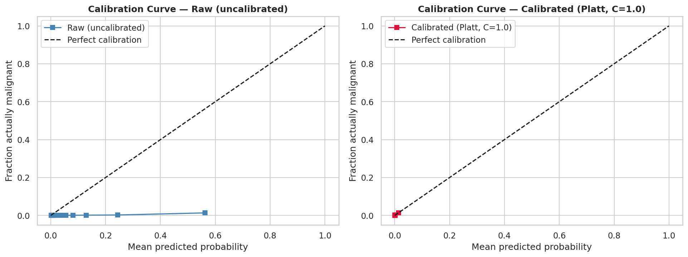

Platt scaling brings the calibrated Brier score to **0.000960** — the best of all three versions and essentially at the theoretical minimum (baseline = 0.000979). The calibrated probabilities track the diagonal almost perfectly, meaning the model's output probabilities are trustworthy for risk tier assignment.

#### v4 — Risk Tier Distribution

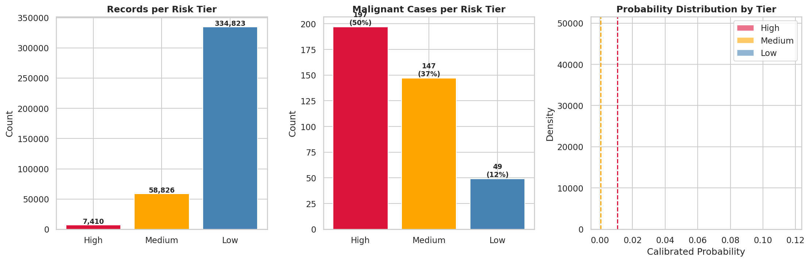

The High-risk tier (7,410 records, 2.66% PPV) is the most precise of all versions. The Medium tier expands to 58,826 records, capturing 37.4% additional sensitivity. Together, High+Medium captures **87.53%** of all malignant cases while covering only 16.5% of the full dataset.

---

## Full Comparison: v2 vs v3 vs v4

### Generalization Performance

| Metric | v2 (Guessed) | v3 (Subsample Tuned) | v4 (Full-Data Tuned) | Winner |
|--------|:------------:|:-------------------:|:--------------------:|:------:|
| PR-AUC (mean ± std) | 0.0539 ± 0.0255 | 0.0481 ± 0.0205 | **0.0551 ± 0.0257** | v4 |
| AUROC (mean ± std) | 0.9347 ± 0.0081 | **0.9403 ± 0.0069** | 0.9362 ± 0.0064 | v3 (marginal) |
| Brier (calibrated) | 0.000963 | 0.000972 | **0.000960** | v4 |

**v4 wins on the primary metric (PR-AUC) and calibration (Brier), which matter most for precision-critical risk stratification.**

### Tuning Reliability

| Metric | v2 | v3 | v4 |
|--------|----|----|-----|
| Approach | Manual (no tuning) | Optuna on subsample | Optuna on full data |
| Optimization metric | — | 0.2822 (subsample) | 0.0543 (full data) |
| Tuning basis size | — | 40k records | 401k records |
| Class imbalance during tuning | — | 1:102 | 1:1020 (true) |
| Generalization gap | — | **5.85×** | **1.08×** |
| Audit trail | None | Optuna trials logged | Optuna trials logged |

### Clinical Performance

| Tier | v2 | v3 | v4 |
|------|:--:|:--:|:--:|
| High-risk count | 13,169 | 7,477 | 7,410 |
| High sensitivity | 50.13% | 50.13% | 50.13% |
| High PPV | 1.50% | 2.62% | **2.66%** |
| High+Medium sensitivity | 76.1% | 74.1% | **87.53%** |

All three models meet the clinical requirement (≥50% sensitivity at High tier). v4 achieves the best PPV in High and the most malignant cases captured across High+Medium combined.

### Tuned Hyperparameters

| Hyperparameter | v2 (Guessed) | v3 (Subsample) | v4 (Full-Data) |
|----------------|:------------:|:--------------:|:--------------:|
| sampling_strategy | 0.1 | 0.069 | **0.168** |
| scale_pos_weight | 10 | 3.46 | **10.43** |
| learning_rate | 0.02 | 0.0184 | **0.0188** |
| num_leaves | 63 | 96 | **38** |
| min_child_samples | 20 | 44 | **76** |
| subsample | 0.8 | 0.641 | **0.720** |
| colsample_bytree | 0.8 | 0.658 | **0.932** |
| reg_alpha | 0.1 | 0.003307 | **0.004172** |
| reg_lambda | 0.1 | 8e-06 | **1e-06** |

v4's `scale_pos_weight` (10.43) almost exactly matches v2's guess (10), independently validating that v2's intuition was correct. v4's `num_leaves` (38) is much lower than v3's subsample-tuned value (96) — the subsample led to overly complex trees.

---

## v4 — Implementation Details

### Pipeline Summary

1. **Preprocessing** — Median/mode imputation, biological value clipping, 6 engineered features, `tbp_lv_symm_2axis` excluded (Mann-Whitney p=0.143)
2. **Stratified Group K-Fold** (k=5, grouped by patient_id) — training folds get SMOTE; validation folds see raw data only
3. **Optuna tuning** (50 trials, 3-fold CV on full 401,059 records) — optimizes mean PR-AUC jointly over 9 parameters
4. **Final 5-fold CV** with best hyperparameters — produces OOF predictions for calibration
5. **Platt scaling** — logistic regression fit on pooled OOF raw probabilities; corrects SMOTE-induced probability inflation
6. **Threshold selection** — Youden's J (Low↔Medium = 0.000357), 50% recall target (Medium↔High = 0.010807)
7. **Risk tier assignment** and model serialization to `outputs/models/v4/`

### Computational Requirements

| Step | Time (WSL2, CPU-only) |
|------|----------------------|
| Preprocessing | < 1 min |
| Optuna tuning (50 trials, 3-fold) | ~2.5 hours |
| Final 5-fold CV | ~30 min |
| Calibration + threshold selection | < 1 min |
| **Total** | **~3 hours** |

---

## v4 — Final Results

### Metrics

| Metric | Value |
|--------|-------|
| Mean PR-AUC (5-fold CV) | **0.0551 ± 0.0257** |
| Mean AUROC (5-fold CV) | 0.9362 ± 0.0064 |
| Calibrated Brier score | 0.000960 |
| Optuna best PR-AUC (full data) | 0.0543 |
| Generalization ratio | **1.08×** |

### Risk Tier Summary

| Tier | Records | % of Total | Malignant | Sensitivity | PPV | vs Base Rate |
|------|--------:|----------:|----------:|:-----------:|:---:|:------------:|
| **High** | 7,410 | 1.8% | 197 | 50.13% | **2.66%** | **27.2×** |
| **Medium** | 58,826 | 14.7% | 147 | 37.40% | 0.25% | 2.6× |
| **Low** | 334,823 | 83.5% | 49 | 12.47% | 0.015% | 0.15× |
| **High + Medium** | 66,236 | 16.5% | 344 | **87.53%** | 0.52% | 5.3× |

The model captures 87.53% of malignant cases using only 16.5% of all records. The High tier is enriched **27× over the population base rate**.

---

## Key Files

| File | Purpose |
|------|---------|
| `notebooks/melanoma_v4.ipynb` | Source code: full pipeline end-to-end |
| `outputs/models/v4/model.pkl` | Trained LightGBM classifier |
| `outputs/models/v4/calibrator.pkl` | Fitted Platt scaling logistic regression |
| `outputs/models/v4/thresholds.pkl` | Risk tier thresholds (dict) |
| `outputs/models/v4/feature_columns.pkl` | Feature names (for reproducibility) |
| `outputs/models/v4/best_params.json` | Optuna best hyperparameters |
| `outputs/results/v4/v4_model_metrics.csv` | Final metrics summary |
| `outputs/results/v4/v4_risk_tiers.csv` | Tier breakdown by record count |
| `outputs/results/v4/v4_threshold_sensitivity.csv` | PR-curve sensitivity analysis |

---

## Inference

```python
import joblib
import pandas as pd

model        = joblib.load('outputs/models/v4/model.pkl')
calibrator   = joblib.load('outputs/models/v4/calibrator.pkl')
thresholds   = joblib.load('outputs/models/v4/thresholds.pkl')
feat_cols    = joblib.load('outputs/models/v4/feature_columns.pkl')

X_test = load_and_preprocess(test_data)[feat_cols]

raw_probs        = model.predict_proba(X_test)[:, 1]
calibrated_probs = calibrator.predict_proba(raw_probs.reshape(-1, 1))[:, 1]

def assign_tier(prob):
    if prob >= thresholds['threshold_high']:
        return 'High'
    elif prob >= thresholds['threshold_medium']:
        return 'Medium'
    return 'Low'

tiers = [assign_tier(p) for p in calibrated_probs]
```

---

## Limitations

- **12.47% of malignant cases remain in Low tier.** At 1:1020 imbalance with tabular-only features, 100% recall without flagging the entire dataset is not feasible.
- **No held-out test set.** All metrics are cross-validated out-of-fold. Performance on a fully independent cohort is unknown.
- **Tabular features only.** Dermoscopic images are not used. Adding image-based embeddings would likely improve discrimination substantially.
- **Patient-level grouping assumes no temporal trends.** Systematic time-dependent patient characteristics could bias fold assignments.

---

## Recommendations

1. **Deploy v4** — best generalization, fully auditable, best clinical performance.
2. **Use as triage, not diagnosis.** With 2.66% PPV in High, ~97% of flagged lesions are benign. Clinical review is required.
3. **Consider image features in v5** if dermoscopy becomes available — the tabular-only ceiling is likely near 90% recall.
4. **Never subsample for tuning speed** without preserving the true class imbalance ratio (lesson from v3).
5. **Validate on an independent ISIC cohort** before clinical deployment.
